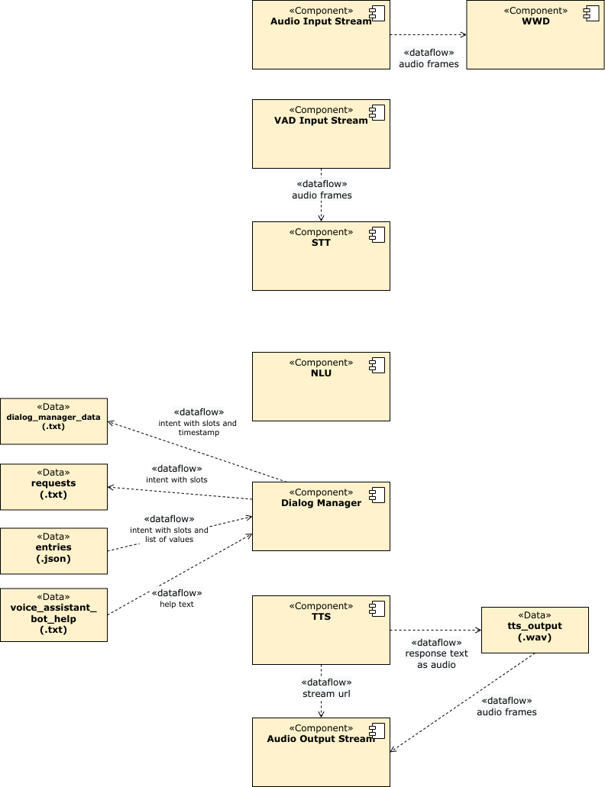

# Project

## Installation
[Installation manual](https://github.com/tlau10/voice_assistant_katja/wiki/Installation)

## Documentation

### Inhaltsverzeichnis
1. [Einleitung](#einleitung)  
    1.1 [Geschäftlicher Kontext](#11-geschäftlicher-kontext)  
    1.2 [Systemüberblick](#12-systemüberblick)  
    1.3 [Rahmenbedingungen](#13-rahmenbedingungen)  
    1.4 [Stakeholder](#14-stakeholder)
2. [System Kontext Abgrenzung](#system-kontext-abgrenzung)
3. [Systemdekomposition](#systemdekomposition)

### 1. Einleitung

#### 1.1 Geschäftlicher Kontext

* Das System soll als Prototyp für einen datensparsamenSprachassistenten dienen.
* Das System soll in der Lage sein über Feedback des Nutzerszu lernen.

#### 1.2 Systemüberblick

Der Sprachassistent soll folgende Funktionalität zur Verfügung stellen:
        
* Das Abrufen einer Wikipedia Definition zu einem beliebigen Begriff
* Das Abspielen eines beliebigen, deutschsprachigen Radiosenders
* Das Beantworten von Fragen zum Mensa Speiseplan der HTWG Konstanz, der aktuellen und nächsten Woche
* Das Stoppen des Sprachassistenten zu jedem Zeitpunkt

    
#### 1.3 Rahmenbedingungen

* Der Sprachassistent soll ausschließlich in der deutschen Sprache verfügbar sein.
* Außer die für die Funktionalität benötigten Daten, sollen keine weiteren Daten gesammelt werden.
* Eine Netzwerkverbindung soll nur für Schnittstellen mit externen APIs verwendet werden.
* Es soll ausschließlich auf offene Software-Komponenten zurückgegriffen werden.
* Der Sprachassistent soll auf einer Arm64-Architektur lauffähig sein.
* Der Sprachassistent soll mit den lokal verfügbaren Rechnerressourcen eines Raspberry Pi 4 (4GB RAM und 1,8 GhzQuadcore CPU) auskommen können.

#### 1.4 Stakeholder
Die Stakeholder sind:

* Besucher der HTWG-Mensa (Studenten/Schüler, Mitarbeiter und Gäste)
* Reguläre Nutzer, die den Sprachassistenten für den Heimgebrauch verwenden
* Prof. Dr. Schneider

### 2. System Kontext Abgrenzung

Für den Wikipedia-Skill wird das PIP-Paket „Wikipedia-API“, alsWrapper für 
die Wikipedia API, verwendet. Alternativ gibt es nochdas „wikipedia“ 
Paket, dies bietet aber eine weniger umfassendeFunktionalität.Für den 
Musik-Skill wird das PIP-Paket „pyradios“, ein Client für denRadio 
Browser, verwendet. Bei dem Radio Browser handelt es sichum eine riesige Datenbank für Radio- und TV-Sender aus aller Welt.

Für den Mensa-Skill wird der Javascript-Parser verwendet, der in ei-nem 
Teamprojekt entstanden ist. Dieser holt sich zunächst dieHTML-Seite der 
HTWG-Mensa und generiert daraus eine JSON-Da-tei mit dem Menü.Das manuelle 
Lernen braucht die Telegram Bot API. Verwendet wirddas PIP-Paket 
„pyTelegramBotAPI“. Als Alternative gibt es noch das„python-telegram-bot“ 
Paket. Mit ersterem lässt sich der Bot jedochdeutlich einfacher und 
übersichtlicher schreiben, da Decorator-Funk-tionen verwendet werden.

### 3. Systemdekomposition 

#### 3.1 Lösungsansätze und wichtige Architekturentscheidungen
Als Architekturstil wurde Batch-Sequential gewählt. Bei Batch-Sequential ist das System 
in einzelne, voneinander unabhängige Komponenten unterteilt. Diese laufen in einer 
vorgegeben Sequenz abund tauschen Daten untereinander, ausschließlich über 
temporäre Dateien, aus. Dieser Architekturstil wurde gewählt, da er die 
Wiederverwendbarkeit erhöht und einzelne Komponenten einfacher ausgetauscht werden können, sollten später Technologien ersetzt werden. Auch der Data Repository Architekturstil wäre hier denkbar gewesen,um stattdessen Daten über eine zentrale Datenbank auszutauschen.Da der sequentielle Ablauf das heißt, dass eine Komponente erst startet sobald die vorherige beendet ist, eine so zentrale Rolle spielt,lässt sich dies mit dem Batch-Sequential Architekturstil jedoch besser darstellen. In Abbildung 9 wird dieser sequentielle Ablauf, an einem Beispiel, genauer erläutert.Als Aktivierungswort wurde „Ok Katja“ bzw. „Okay Katja“ gewählt. Inspiriert wurde dies von „Ok Google“, da es sich hier um ein sehr gutes Aktivierungswort handelt. Es besteht wie die meisten Aktivierungswörter aus drei Silben und besitzt eine ausreichende Anzahl an verschiedenen Phonemen. Außerdem gibt es nur wenige Worte die ähnlich klingen. Währenddessen reduziert das vorgeschobene „Ok“ weiter die Wahrscheinlichkeit eines falschen Alarms. Da der Sprachassistent auf Datensicherheit ausgelegt ist, wäre ein falsch-positiver Alarm besonders problematisch. Hier würde sonst ungewoll tmitgehört werden.
Da es das Mozilla Deepspeech Aarch64 Python-Wheel für denRaspberry Pi leider nur bis 
Python-Version 3.7 gibt wurde hier dieVersion 3.7 verwendet, obwohl bereits die 
Python-Version 3.10.4 ver-fügbar ist.

#### 3.2 Systenstruktur

Das Herzstück des Systems ist der Dialog Manager. Dieser lässt sich, wie im Diagramm 
veranschaulicht, nochmal weiter differenzieren. Die in dem Diagramm dargestellten 
Listener wurden der einfacheren Darstellung wegen mit einem Rechteck umrandet. Dieses 
besitzt sonst keine inhaltliche Relevanz. Aus den Anforderungen hat sich ergeben, dass 
das Interaktionsmo-dell der NutzerInitiative für dieses System mehr Sinn macht. Daher 
ist der DM auch nach diesem Modell aufgebaut.

Um den erkannten Intent mit der Funktion, die diesen umsetzt zu verknüpfen, wird ein 
Event-basierter Ansatz verwendet. Über den Observer ruft der Dialog Manager beim Start 
des Systems, die „setup()“-Methoden aller Listener auf. Diese verwenden dann die 
„subscribe()“-Methode, um sich als Event zu registrieren. Wird ein Intent erkannt, so 
muss der Dialog Manager nur noch ein Event mit der „post()“-Methode abschicken. Über das 
Event wird dann die registrierte „handler()“-Methode des richtigen Intents aufgerufen. 
Ein Event kann auch mit mehreren „handler()“-Methoden verknüpft sein.
Aufgaben der einzelnen Listener:
* Der Mensa-Skill Listener verarbeitet den Speiseplan der Mensa als JSON-Datei.
* Der Musik-Skill Listener holt sich über die Radio Browser API die URL des Radiosenders
* Der Wikipedia-Skill Listener holt sich über die Wikipedia API die Zusammenfassung eines Wikipedia Artikels.
* Wird der Sprachassistent gestoppt, so wird der Stop-Skill Lis-tener ausgeführt. Der Antworttext ist einfach eine leere Zeichenkette.
* Wird keiner der bisher genannten Intents erkannt, so wird der None-Skill Listener gestartet. Als Antworttext wird dem Nutzer mitgeteilt, dass der Sprachbefehl nicht umgesetzt werden konnte.
Alle Skill Listener schreiben ihren Antworttext in eine Datei, die dann von der TTS-Komponente weiterverarbeitet wird.

#### 3.3 Sequenzdiagramm

Die WWD-Komponenten hört dauerhaft auf den Audio-Input-Stream und versucht daraus das 
Aktivierungswort zu erkennen. Wird das Aktivierungswort erkannt, so wird die 
STT-Komponente gestartet. Damit die STT nur solange auf den Audio-Input-Stream hört wie 
für den geäußerten Sprachbefehl nötig, wird ein VAD-Audio-Stream verwendet. Das Gehörte 
wird dann als Text transkribiert. Im nächsten Schritt wird die NLU-Komponente gestartet, 
die den erfassten Text einem Intent zuordnet. Zusätzlich dazu werden aus dem Text die 
Slots und die dazugehörigen Slot-Werte extrahiert. Als nächstes wird dann der Dialog 
Manager gestartet. Dieser ordnet dem erkannten Intent, die Funktion zu, die diesen dann 
umsetzt. Die Funktion generiert wiederum neuen Output, welche die TTS-Komponente 
anschließend verarbeitet.

Im Falle des Mensa-Intents generiert die TTS aus dem Antworttext eine Audio-Datei, die dann über 
den Audio-Ouput-Stream abgespielt wird.Während das Audio noch abgespielt wird, kann die 
WWD-Komponente erneut auf den Audio-Input-Stream hören. Somit wird gewährleistet, dass der 
Sprachassistent jederzeit gestoppt oder einfach einneuer Sprachbefehl geäußert werden kann. Wie der 
Datenaustausch der einzelnen Komponenten aussieht, wird in [Abbildung 12](#34-datenmodell) genauer erklärt.

#### 3.4 Datenmodell

Das Diagramm zeigtdie Konfigurationsdateien der einzelnen Module. Das „wake word 
model“, der „access key“ und die „dataset.json“ werden zur Entwicklungszeit 
individuell generiert, die restlichen Konfigurationsdateien sind bereits 
vorgefertigt. Bei dem „acoustic model“ gibt es neben der „pbmm“-Datei noch eine 
„tflite“-Version, welche für Geräte mit weniger Hardwareressourcen, wie dem RPI, 
optimiert ist.

Das Diagramm stellt den Prozess der Konfigurationsdateierstellung für die 
NLU-Komponente dar. Im ersten Schritt wird für jeden Skilleine YAML-Datei angelegt, 
um die dazugehörigen Intents, Utterances, Slots und Entities zu definieren. Für jede 
Entity müssen Beispieldaten angegeben werden, damit die NLU den Slot später 
bessererkennt. Snips bietet auch bereits vorgefertigte Entities, beispielsweise für 
Zahlen oder Datums- und Zeitangaben an. Auch gibt es die Möglichkeit für Slot-Werte 
Synonyme zu definieren und damit die Genauigkeit der NLU zu erhöhen. Nachdem alles 
definiert ist, wird mithilfe der Snips CLI und dem ausgewählten Sprachpaket die 
„dataset.json“ generiert. Das Generieren ist nicht deterministisch, mehrfaches 
generieren kann also unterschiedliche Ergebnisse erzeugen.

Das Diagramm zeigt den Austausch von Daten zwischen den einzelnen Komponenten zur 
Laufzeit. Die Komponenten tauschen nie direkt Daten miteinander aus, sondern 
schreiben ihren Output immer in eine Datei. Für die nachfolgende Komponente ist 
diese dann der Input. Die TTS-Komponente erhält im Falle des Musik-Skills eine URL, 
während für die anderen Skills immer eine Audio-Datei aus dem Antworttext generiert 
wird.

Für das manuelle Lernen kamen die drei Dateien „dialog_manager_data.txt“, „requests.
txt“ und „entries.json“ dazu. Diese werden benötigt, um mit dem Bot und dem Bot 
Listener zu kommunizieren. Die „voice_assistant_bot_help.txt“ enthält zusätzlich den 
Hilfetext der über den Bot abgerufen werden kann. Genaueres dazu in 5.2 Manuelles 
Lernen.

#### 3.5 Klassendiagramm

Das Diagramm zeigt die Aufteilung der einzelnen Komponenten in Klassen. Die 
verwendeten Technologien Porcupine, Deepspeech, Snips und Pico besitzen jeweils eine 
eigene Unterklasse. Dadurch können diese ohne großen Aufwand ausgetauscht werden. 
Die Klasse „VoiceAssistant“ orchestriert das komplette System. Die rötlich gefärbten 
Klassen in den Komponenten, sind die Oberklassen. Diese werden in der Klasse 
„VoiceAssistant“ instanziiert und der Reihe nach gestartet. Gestartet wird eine 
Komponente durch aufrufender „start()“-Methode. Mit Ausnahme der WWD-Komponente, 
werden dadurch immer Daten aus einer Datei eingelesen, verarbeitet und anschließend 
der Output wieder in eine Datei geschrieben. Erst wenn die vorangegangene Komponente 
beendet ist, kann die nächste gestartet werden.

#### 3.6 Deployment und Betrieb

Das Diagramm zeigt, wie das System auf dem RPI zur Ausführung gebracht wird. In 
einer virtuellen Python-Umgebung, mit der Python-Version 3.7, sind alle benötigten 
Abhängigkeiten PIP-Pakete installiert. Die für den „mensa_data_requester.py“ 
verwendeten NPM-Pakete hingegen, sind unabhängig von der Python-Umgebung auf dem 
Betriebssystem installiert. Um den Sprachassistent zu starten, wird mithilfe des 
Python-Interpreters die „voice_assistant_main.py“ gestartet. Jede Komponente hat ihr 
eigenes Python-Skript, dieses wird in der „voice_assistant_main.py“ der Reihe nach 
aufgerufen. Allgemeine Funktionen, wie zum Beispiel die zum Lesen oder Schreiben von 
Dateien, wurden in das „voice_assistant_helper.py“ Skript ausgelagert, da diese an 
vielen Stellen verwendet werden. Die „Listener.py“ ist der Einfachheit halber nur 
als einzelnes Skript dargestellt. Im System gibt es jedoch für jeden Skill ein 
eigenes Listener-Skript.Für das manuelle Lernen kam noch ein Bot Listener-Skript 
hinzu, siehe Abbildung 17. Die „setup_cronjob.py“ und der „mensa_data_requester.py“ 
kamen, mit dem in 3.5.2 Data Concept beschriebenen Konzept, hinzu. Außerhalb der 
Python-Umgebung läuft dauerhaft ein Audio-Player-Prozess. Genaueres dazu in 3.5.3 
Audio-Player Concept. Für das manuelle Lernen kamen der „voice_assistant_bot.py“, 
der automatisch startet sobald der Sprachassistent gestartet wird, dazu. Der 
„voice_assistant_bot_helper.py“ enthält ähnlich wie der„voice_assistant_helper.py“ 
allgemeine Funktionen, die für den Bot und die Listener benötigt werden.
